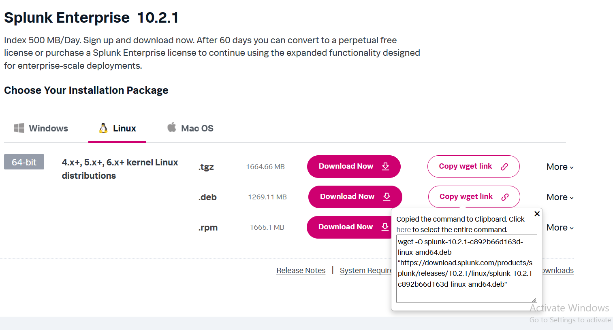
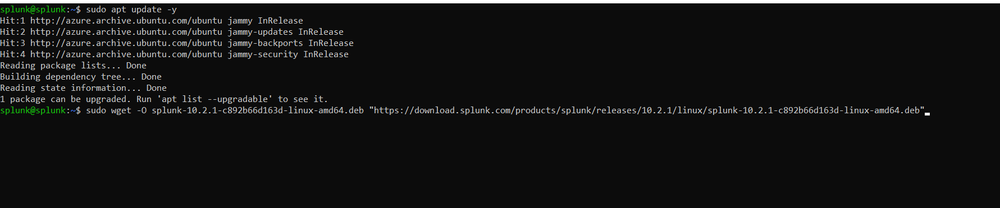
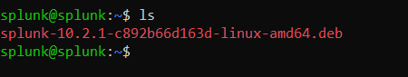
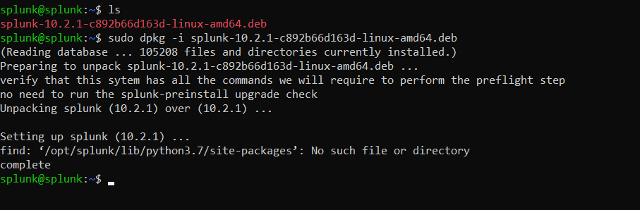
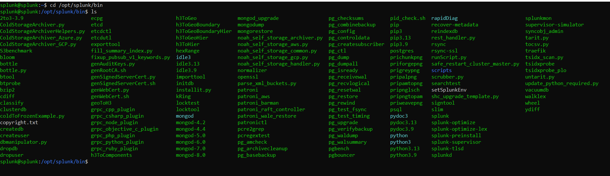
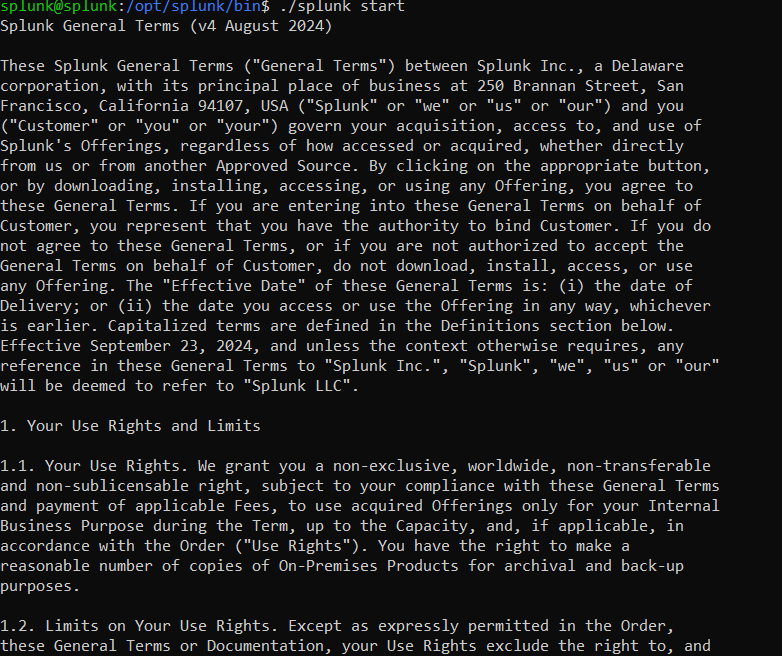
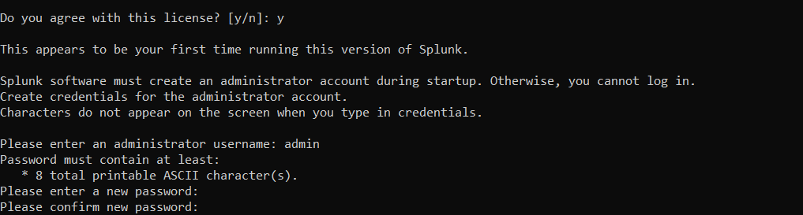

# Splunk_Home_Lab
Siz burada Splunk Enterprise-in Microsoft Azure üzərində Ubuntu serverdə quraşdırılmasını, həmçinin Splunk Forwarder-in Windows üzərində quraşdırılmasını və logların Splunk-a yönləndirilməsini şəkillərlə birlikdə görə bilərsiniz
Splunk Enterprise Quraşdırılması

Splunk Enterprise-i quraşdırmaq üçün ilk addım Splunk-un rəsmi saytına daxil olmaq və oradan uyğun quraşdırma paketini yükləməkdir.

Aşağıdakı şəkillərdə Splunk Enterprise (.deb) paketinin quraşdırılması göstərilmişdir. Bundan əlavə, istəyə görə digər uzantılı paketləri də quraşdıra bilərsiniz. Bu isə tamamilə opsional seçimdi

Növbəti addımda Splunk-un quraşdırıldığı qovluğa keçməliyik. Bunun üçün aşağıdakı əmrdən istifadə edirik:

Növbəti mərhələdə Splunk lisenziyasını qəbul edirik və Splunk Web interfeysinə daxil olmaq üçün istifadəçi adı və parol təyin edirik. Bu addım sistemə təhlükəsiz giriş üçün vacibdir

