# Splunk_Home_Lab
Siz burada Splunk Enterprise-in Microsoft Azure üzərində Ubuntu serverdə quraşdırılmasını, həmçinin Splunk Forwarder-in Windows üzərində quraşdırılmasını və logların Splunk-a yönləndirilməsini şəkillərlə birlikdə görə bilərsiniz
Splunk Enterprise Quraşdırılması

Splunk Enterprise-i quraşdırmaq üçün ilk addım Splunk-un rəsmi saytına daxil olmaq və oradan uyğun quraşdırma paketini yükləməkdir.

Aşağıdakı şəkillərdə Splunk Enterprise (.deb) paketinin quraşdırılması göstərilmişdir. Bundan əlavə, istəyə görə digər uzantılı paketləri də quraşdıra bilərsiniz. Bu isə tamamilə opsional seçimdi

Növbəti addımda Splunk-un quraşdırıldığı qovluğa keçməliyik. Bunun üçün aşağıdakı əmrdən istifadə edirik:

Növbəti mərhələdə Splunk lisenziyasını qəbul edirik və Splunk Web interfeysinə daxil olmaq üçün istifadəçi adı və parol təyin edirik. Bu addım sistemə təhlükəsiz giriş üçün vacibdir

Daha sonra isə aşağıdakı şəkildə göstərildiyi kimi Splunk-un uğurla quraşdırılıb-quraşdırılmadığını yoxlayırıq. Bu addım quraşdırmanın düzgün tamamlandığını təsdiqləmək üçün vacibdir.

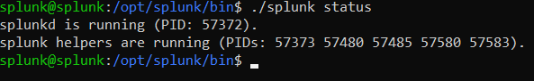

Daha sonra serverin IP ünvanı vasitəsilə Splunk Web interfeysinə daxil oluruq. Bunun üçün brauzerdə serverin IP ünvanını və Splunk-un standart portunu istifadə edirik.

http://SERVER_IP:8000

 QEYD!  Splunk Web interfeysinə daxil olmaq üçün 8000 portunun firewall üzərindən açıq olması mütləqdir. Əks halda brauzer vasitəsilə Splunk Web interfeysinə qoşulmaq mümkün olmayacaq.
 
 Gördüyünüz kimi Splunk Web giriş səhifəsi açılır və burada admin istifadəçi adı və təyin etdiyimiz parol ilə sistemə daxil ola bilərik
 
 
 Splunk Web interfeysinə daxil olduqdan sonra bizi aşağıdakı kimi bir səhifə qarşılayır. Növbəti mərhələyə keçmək üçün Windows üzərində Splunk Forwarder quraşdırmaq məqsədilə 9997 portunu aktiv etməliyik.

Bu port müxtəlif cihazlardan Splunk serverinə logların göndərilməsi (log forwarding) üçün istifadə olunur.

Qeyd: 9997 portu yalnız Splunk daxilində deyil, eyni zamanda Splunk-un quraşdırıldığı serverin firewall-unda (təhlükəsizlik divarında) da mütləq açıq olmalıdır. Əks halda digər cihazlardan logların Splunk-a göndərilməsi mümkün olmayacaq.

Aşağıdakı şəkillərdə bu prosesin necə icra olunduğu göstərilmişdir.

  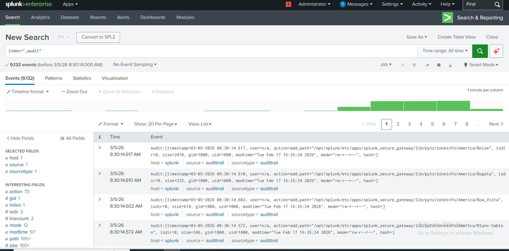
  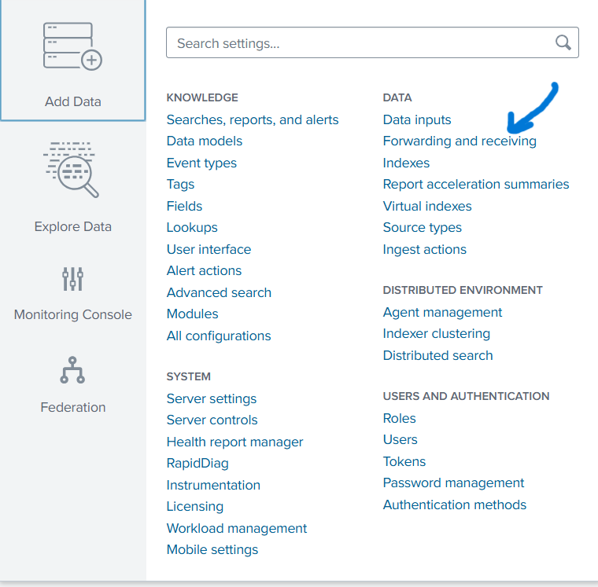
  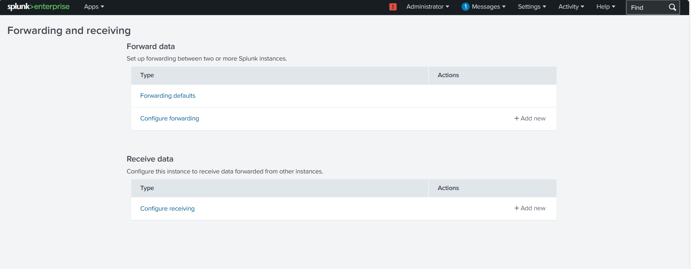 
  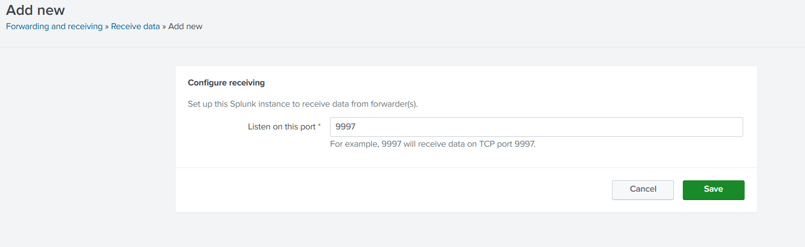
  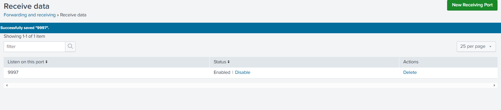
  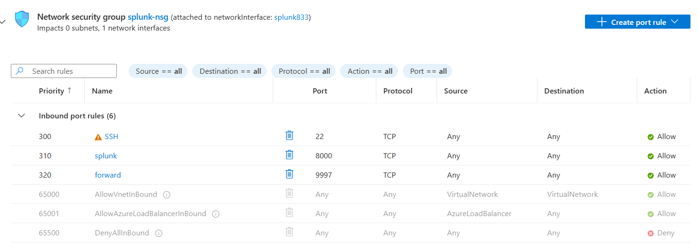

  Windows Üzərində Splunk Forwarder Quraşdırılması

Növbəti addımda Windows üzərində Splunk Forwarder quraşdırmaq üçün rəsmi Splunk Forwarder saytına daxil oluruq. Oradan uyğun quraşdırma paketini seçirik və PowerShell üzərindən yükləyirik.

Qeyd: İstəsəniz, paket digər üsullarla da yüklənə bilər.

 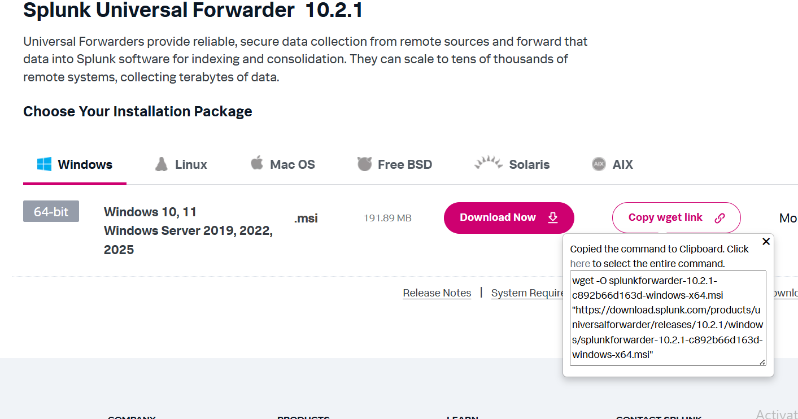
 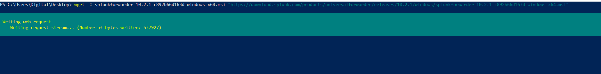

 Aşağıdakı şəkillərdə Windows üzərində Splunk Forwarder-in quraşdırılma prosesini görə bilərsiniz.

  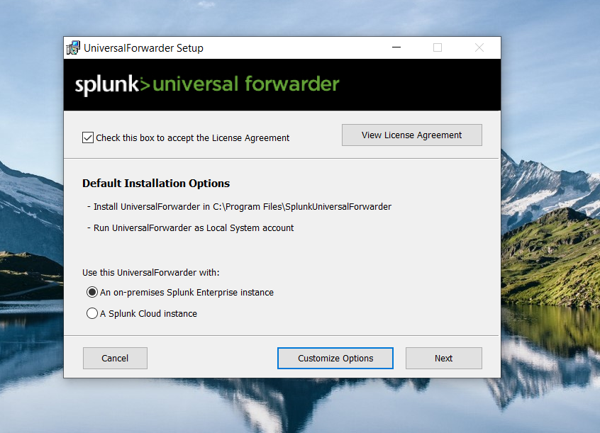
  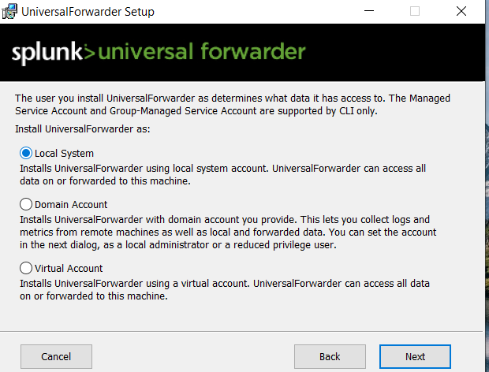
  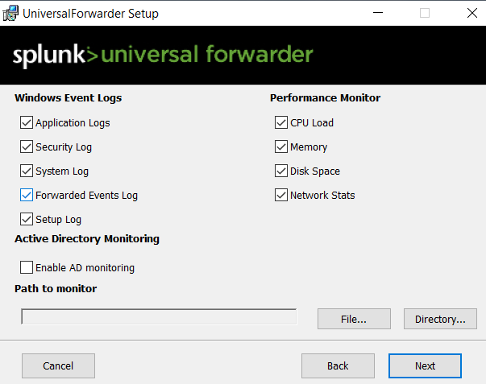
  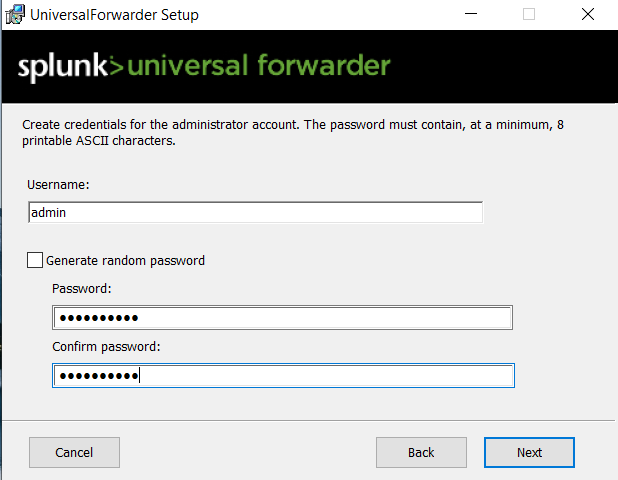
  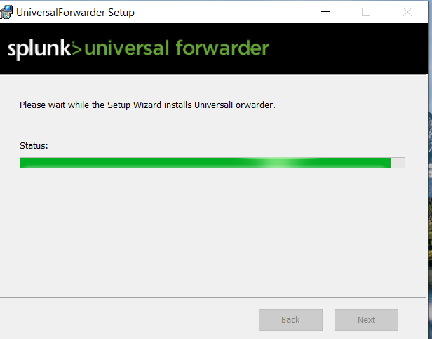
 

  

  

 

 
 

